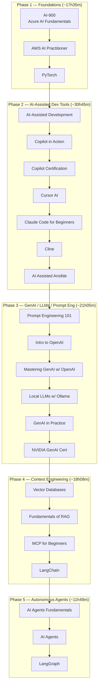

# AI Learning Curriculum — Sequenced Path

Based on the KodeKloud AI Learning Path (19 courses, 5 clusters). Sequenced by prerequisite logic and Bloom's progression (foundational → applied → creative).

## Phase Details

### Phase 1 — AI Foundations & Core ML

| Order | Course                        | Duration |
| ----- | ----------------------------- | -------- |
| 1     | AI-900: Azure AI Fundamentals | 4h10m    |
| 2     | AWS Certified AI Practitioner | 6h00m    |
| 3     | PyTorch                       | 7h25m    |

### Phase 2 — AI-Assisted Development & Coding Tools

| Order | Course                       | Duration |
| ----- | ---------------------------- | -------- |
| 1     | AI-Assisted Development      | 6h20m    |
| 2     | GitHub Copilot in Action     | 2h30m    |
| 3     | GitHub Copilot Certification | 5h34m    |
| 4     | Cursor AI                    | 3h48m    |
| 5     | Claude Code For Beginners    | 8h32m    |
| 6     | Cline                        | 2h13m    |
| 7     | AI Assisted Ansible          | 1h48m    |

### Phase 3 — Generative AI, LLMs & Prompt Engineering

| Order | Course                              | Duration |
| ----- | ----------------------------------- | -------- |
| 1     | Prompt Engineering 101              | 5h00m    |
| 2     | Introduction to OpenAI              | 4h10m    |
| 3     | Mastering Generative AI with OpenAI | 5h00m    |
| 4     | Running Local LLMs With Ollama      | 2h15m    |
| 5     | Generative AI in Practice           | 3h52m    |
| 6     | NVIDIA GenAI LLMs Associate Cert    | 0h48m    |

### Phase 4 — Context Engineering (RAG, Vector DBs, MCP)

| Order | Course              | Duration |
| ----- | ------------------- | -------- |
| 1     | Vector Databases    | 4h26m    |
| 2     | Fundamentals of RAG | 6h01m    |
| 3     | MCP For Beginners   | 2h31m    |
| 4     | LangChain           | 5h10m    |

### Phase 5 — Autonomous AI Agents

| Order | Course                 | Duration |
| ----- | ---------------------- | -------- |
| 1     | AI Agents Fundamentals | 1h33m    |
| 2     | AI Agents              | 5h18m    |
| 3     | LangGraph              | 4h58m    |

**Core path total: ~99h22m**

## Electives (parallel, role-track)

- AI-102: Azure AI Engineer Associate (after Phase 1)
- AWS SageMaker (after Phase 1)
- Fundamentals of MLOps (after Phase 1)
- K8sGPT (after Phase 2)
