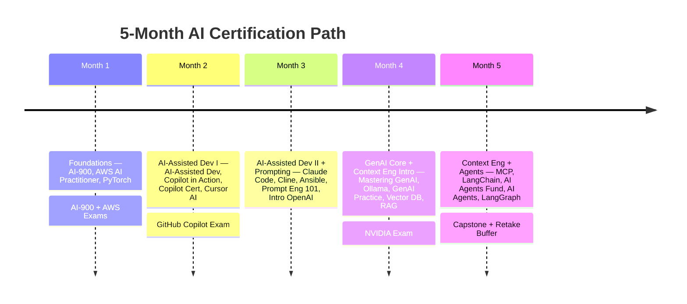

# 5-Month Certification Schedule — 2 Cohorts × 25 Engineers

20 weeks, ~4 weeks/month. Video runtime only — budget 2–3x for labs/exercises.

## Weekly Breakdown

| Wk | Course(s) | Hours | Note |
|---|---|---|---|
| 1 | AI-900 | 4:10 | |
| 2 | AWS AI Practitioner | 6:00 | |
| 3–4 | PyTorch | 7:25 | **Wk4: AI-900 + AWS exams** |
| 5 | AI-Assisted Development | 6:20 | |
| 6 | GitHub Copilot in Action | 2:30 | |
| 7 | GitHub Copilot Certification | 5:34 | |
| 8 | Cursor AI | 3:48 | **Wk8: Copilot exam** |
| 9 | Claude Code For Beginners | 8:32 | Heavy/lab-intensive week |
| 10 | Cline + AI Assisted Ansible | 4:01 | Recovery week |
| 11 | Prompt Engineering 101 | 5:00 | |
| 12 | Introduction to OpenAI | 4:10 | |
| 13 | Mastering GenAI with OpenAI | 5:00 | |
| 14 | Ollama + GenAI in Practice + NVIDIA cert | 6:55 | **Wk14: NVIDIA exam** |
| 15 | Vector Databases | 4:26 | |
| 16 | Fundamentals of RAG | 6:01 | |
| 17 | MCP For Beginners | 2:31 | |
| 18 | LangChain | 5:10 | |
| 19 | AI Agents Fundamentals + AI Agents | 6:51 | |
| 20 | LangGraph + Capstone | 4:58 | **Retake/buffer window** |

## Notes

- **Pacing pattern:** intentional heavy/light alternation (e.g. Wk9 heavy → Wk10 light) instead of flat weekly hours — reduces burnout without slowing the overall pace.
- **Don't gate progress on cert results.** Both cohorts keep moving on schedule; anyone who fails a cert attempt retakes it in the Wk14/Wk20 buffer windows rather than blocking the group.
- **Two cohorts, one calendar.** Run both groups on this same 20-week plan; split live sessions across two days/week (e.g. Group A Mon/Wed, Group B Tue/Thu) instead of running two separate curricula.
- **Tracking:** one Linear issue per person per phase, closed only on cert pass — gives a live "% certified" view across both cohorts.